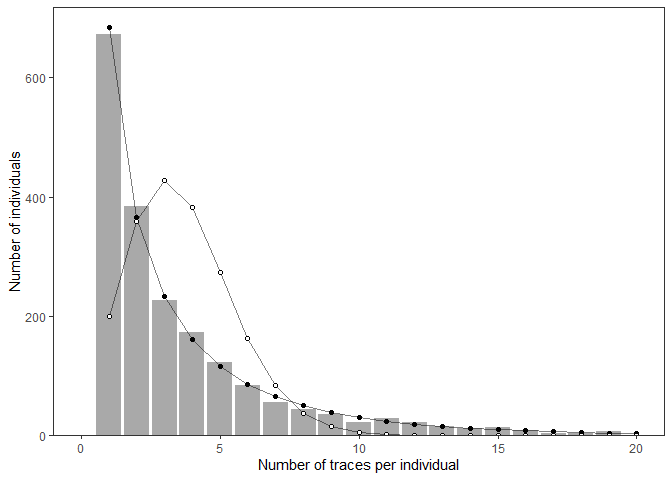

Assigning individuals to regions
================

This reposity contains the code for the paper “Assigning individuals to
their administrative region in spatial sampling” by martin Sköld. The
code is written as an R package, and can be installed using the
following code:

``` r
devtools::install_github("mskoldSU/bearRegions")
```

In addition to code for producing results, the package also contains
data and intermediate results from the computations, as well as code for
reproducing figures and tables.

``` r
library(tidyverse)
library(bearRegions)
library(polyCub)
gpclibPermit() # accept gpclib license required for polyCub::polyCub.exact.Gauss
```

    ## [1] TRUE

Data from the Swedish brown bear monitoring program is available in the
package. The data is stored in the `bear_coordinates` data frame, and
contains the following columns:

- `id` Individual identifier (from Rovbase 3.0)
- `sex` Sex of animal
- `survey_region` Survey region where the individual was sampled
- `mean_east` Mean easting of the individual’s samples (meters)
- `mean_north` Mean northing of the individual’s samples (meters)
- `sd_east` Standard deviation of easting of the individual’s samples
  (meters)
- `sd_north` Standard deviation of northing of the individual’s samples
  (meters)
- `n_samples` Number of samples from the individual
- `dist_to_border` Distance to the nearest border of the survey region
  (meters)

``` r
glimpse(bear_coordinates)
```

    ## Rows: 2,749
    ## Columns: 9
    ## $ id             <chr> "BI000030", "BI040038", "BI040094", "BI040515", "BI0406…
    ## $ sex            <chr> "Female", "Female", "Male", "Female", "Female", "Female…
    ## $ survey_region  <chr> "Region C", "Region B", "Region B", "Region D", "Region…
    ## $ mean_east      <dbl> 482193.0, 577270.8, 604326.0, 467316.3, 386081.2, 53167…
    ## $ mean_north     <dbl> 7139709, 7137679, 7144001, 6832233, 6861111, 6763660, 6…
    ## $ sd_east        <dbl> NA, 3327.01552, NA, 6801.83389, 1911.82928, 1159.82753,…
    ## $ sd_north       <dbl> NA, 6248.6579, NA, 6654.1128, 6128.4725, 5618.5210, 203…
    ## $ n_samples      <dbl> 1, 4, 1, 3, 5, 7, 2, 3, 3, 4, 1, 2, 9, 5, 3, 4, 14, 11,…
    ## $ dist_to_border <dbl> 23942.452, 19607.589, 43797.287, 1702.767, 21172.797, 8…

### Number of samples per individual

The distribution of the number of samples per individual is assumed to
be either Poisson or Negative binomial. Since individuals with zero
samples are not recorded in the data, parameters are estimated using
zero-truncated versions of the distributions. Maximum likelihood
estimates of the parameters are obtained using the `fit_ztPo` and
`fit_ztNB` functions. Only animals with mean coordinate more than 20 km
from the border of the survey region are included in the analysis.

``` r
# Poisson
Po_par <- bear_coordinates |> 
  filter(dist_to_border > 20000) |> 
  pull(n_samples) |> 
  fit_ztPo()
Po_par
```

    ## $lambda
    ## [1] 3.577879

``` r
# Negative binomial
NB_pars <- bear_coordinates |> 
  filter(dist_to_border > 20000) |> 
  pull(n_samples) |> 
  fit_ztNB()
NB_pars
```

    ## $theta
    ## [1] 0.2699858
    ## 
    ## $lambda
    ## [1] 1.447061

The two distributions predicts very different probabilities of zero
detections

``` r
dpois(0, lambda = Po_par$lambda)
```

    ## [1] 0.02793488

``` r
dnbinom(0, size = NB_pars$theta, mu = NB_pars$lambda)
```

    ## [1] 0.6068513

Fits are illustrated in Figure 3A

``` r
fig3A()
```

<!-- -->

### Home range size

The paper uses sigma, the standard deviation of the bivariate normal
distribution, as a measure of home range size. The function
`sigma_table` computes sigma for each individual, using the median,
trimmed mean and pooled standard deviation of the easting and northing
coordinates. The function returns a data frame.

``` r
sigma <- bear_coordinates |> 
  filter(dist_to_border > 20000) |> 
  sigma_table()
sigma
```

    ## # A tibble: 6 × 3
    ##   sex     ac_sd sd_method
    ##   <chr>   <dbl> <chr>    
    ## 1 Female  3066. median   
    ## 2 Male    4323. median   
    ## 3 Female  4701. trimmed  
    ## 4 Male    6822. trimmed  
    ## 5 Female  7425. pooled   
    ## 6 Male   10642. pooled

### Predicting activity center locations, Poisson distribution

Individuals with samples more than 20 km from the border of the survey
region are assumed to be resident in the survey region. For these
individuals, the activity center location is estimated by the mean of
observed coordinates. For individuals with samples less than 20 km from
the border, the activity center location is estimated by maximum
likelihood, using the `fit_center_Po` function. The function returns a
list with the estimated activity center location and the probability of
the individual being resident in the survey region. The following code
fits the activity center location for each individual in
`bear_coordinates` and for each of the three estimates of home range
size in `sigma`. The region of the activity center location is computed
using the `region` function in the final step.

``` r
fitted_values_Po <- full_join(bear_coordinates, sigma, by = "sex", relationship = "many-to-many") |> 
  rowwise() |> 
  mutate(mu = if_else(dist_to_border > 20000, # if more than 20 km from border
                      list(list(mu_east = mean_east, mu_north = mean_north, p = 1)),
                      list(fit_center_Po(east = mean_east, north = mean_north, 
                                         k = n_samples, 
                                         sigma = ac_sd,
                                         region_name = survey_region,
                                         lambda = Po_par$lambda)
                      )
  ),
  mu_east = mu$mu_east,
  mu_north = mu$mu_north,
  p = mu$p,
  region = bearRegions:::region(mu_east, mu_north)
  )
```

``` r
glimpse(fitted_values_Po)
```

    ## Rows: 8,247
    ## Columns: 16
    ## Rowwise: 
    ## $ id             <chr> "BI000030", "BI000030", "BI000030", "BI040038", "BI0400…
    ## $ sex            <chr> "Female", "Female", "Female", "Female", "Female", "Fema…
    ## $ survey_region  <chr> "Region C", "Region C", "Region C", "Region B", "Region…
    ## $ mean_east      <dbl> 482193.0, 482193.0, 482193.0, 577270.8, 577270.8, 57727…
    ## $ mean_north     <dbl> 7139709, 7139709, 7139709, 7137679, 7137679, 7137679, 7…
    ## $ sd_east        <dbl> NA, NA, NA, 3327.016, 3327.016, 3327.016, NA, NA, NA, 6…
    ## $ sd_north       <dbl> NA, NA, NA, 6248.658, 6248.658, 6248.658, NA, NA, NA, 6…
    ## $ n_samples      <dbl> 1, 1, 1, 4, 4, 4, 1, 1, 1, 3, 3, 3, 5, 5, 5, 7, 7, 7, 2…
    ## $ dist_to_border <dbl> 23942.452, 23942.452, 23942.452, 19607.589, 19607.589, …
    ## $ ac_sd          <dbl> 3065.547, 4700.904, 7424.877, 3065.547, 4700.904, 7424.…
    ## $ sd_method      <chr> "median", "trimmed", "pooled", "median", "trimmed", "po…
    ## $ mu             <list> [482193, 7139709, 1], [482193, 7139709, 1], [482193, 7…
    ## $ mu_east        <dbl> 482193.0, 482193.0, 482193.0, 577270.7, 577270.7, 57722…
    ## $ mu_north       <dbl> 7139709, 7139709, 7139709, 7137679, 7137679, 7137625, 7…
    ## $ p              <dbl> 1.0000000, 1.0000000, 1.0000000, 1.0000000, 0.9999858, …
    ## $ region         <chr> "Region C", "Region C", "Region C", "Region B", "Region…

### Predicting activity center locations, Negative binomial distribution

Same as above, but using the Negative binomial distribution instead of
the Poisson distribution.

``` r
fitted_values_NB <- full_join(bear_coordinates, sigma, by = "sex", relationship = "many-to-many") |> 
  rowwise() |> 
  mutate(mu = ifelse(dist_to_border > 20000,
                     list(list(mu_east = mean_east, mu_north = mean_north, p = 1)),
                     list(fit_center_NB(east = mean_east, north = mean_north, 
                                        k = n_samples, 
                                        sigma = ac_sd,
                                        region_name = survey_region,
                                        lambda = NB_pars$lambda, theta = NB_pars$theta)
                     )
  ),
  mu_east = mu$mu_east,
  mu_north = mu$mu_north,
  p = mu$p,
  region = bearRegions:::region(mu_east, mu_north)
  )
```

``` r
glimpse(fitted_values_NB)
```

    ## Rows: 8,247
    ## Columns: 16
    ## Rowwise: 
    ## $ id             <chr> "BI000030", "BI000030", "BI000030", "BI040038", "BI0400…
    ## $ sex            <chr> "Female", "Female", "Female", "Female", "Female", "Fema…
    ## $ survey_region  <chr> "Region C", "Region C", "Region C", "Region B", "Region…
    ## $ mean_east      <dbl> 482193.0, 482193.0, 482193.0, 577270.8, 577270.8, 57727…
    ## $ mean_north     <dbl> 7139709, 7139709, 7139709, 7137679, 7137679, 7137679, 7…
    ## $ sd_east        <dbl> NA, NA, NA, 3327.016, 3327.016, 3327.016, NA, NA, NA, 6…
    ## $ sd_north       <dbl> NA, NA, NA, 6248.658, 6248.658, 6248.658, NA, NA, NA, 6…
    ## $ n_samples      <dbl> 1, 1, 1, 4, 4, 4, 1, 1, 1, 3, 3, 3, 5, 5, 5, 7, 7, 7, 2…
    ## $ dist_to_border <dbl> 23942.452, 23942.452, 23942.452, 19607.589, 19607.589, …
    ## $ ac_sd          <dbl> 3065.547, 4700.904, 7424.877, 3065.547, 4700.904, 7424.…
    ## $ sd_method      <chr> "median", "trimmed", "pooled", "median", "trimmed", "po…
    ## $ mu             <list> [482193, 7139709, 1], [482193, 7139709, 1], [482193, 7…
    ## $ mu_east        <dbl> 482193.0, 482193.0, 482193.0, 577270.7, 577270.7, 57722…
    ## $ mu_north       <dbl> 7139709, 7139709, 7139709, 7137679, 7137679, 7137625, 7…
    ## $ p              <dbl> 1.0000000, 1.0000000, 1.0000000, 1.0000000, 0.9999858, …
    ## $ region         <chr> "Region C", "Region C", "Region C", "Region B", "Region…

Since the computations are time consuming, the results
`fitted_values_Po` and `fitted_values_NB` are saved in the package.

### Figures and Tables

Based on `fitted_values_Po` and `fitted_values_NB`, code for reproducing
figures and tables are available as functions `figX` / `tabX` in the
package. For example, Table 2 is reproduced by the following code.

``` r
tab2()
```

    ## # A tibble: 4 × 7
    ##   survey_region `Region A`  `Region B`  `Region C`   `Region D`  `Bothnian bay`
    ##   <chr>         <chr>       <chr>       <chr>        <chr>       <chr>         
    ## 1 Region A      391 (97.3%) 9 (2.2%)    -            -           2 (0.5%)      
    ## 2 Region B      1 (0.3%)    321 (93.6%) 21 (6.1%)    -           -             
    ## 3 Region C      -           12 (1.0%)   1117 (96.7%) 26 (2.3%)   -             
    ## 4 Region D      -           -           28 (3.3%)    814 (95.9%) -             
    ## # ℹ 1 more variable: Norway <chr>

### Simulation study

The simulation study focuses on the case of a straight border and the
Poisson distribution. Four values of lambda are considered for a grid of
values of delta. For each combination of lambda and delta, 10000
individuals are simulated.

``` r
set.seed(123)
lambda_range <- 1:4
delta_range <- seq(-1, 2, by = .25)

N <- 10000

log_lik <- function(delta, lambda, k, d){
  # Simplified log-likelihood for straight border (equation (4) in the paper)
  pnorm(0, delta) * lambda - k * (d - delta)^2/2
}

simulation_results <- expand_grid(lambda = lambda_range, 
                                  delta = delta_range,
                                  id = 1:N) |>
  mutate(n = actuar::rztpois(n(), lambda), 
         k = actuar::rztbinom(n(), prob =  1 - pnorm(0, delta), size = n)) |> 
  rowwise() |> 
  mutate(
    d = mean(truncnorm::rtruncnorm(k, a = 0, mean = delta)),
    delta_hat = optimise(log_lik, lower = -50, upper = 50, maximum = TRUE, 
                         lambda = lambda, k= k, d = d)$maximum)
```

### Version information

``` r
sessionInfo()
```

    ## R version 4.3.1 (2023-06-16 ucrt)
    ## Platform: x86_64-w64-mingw32/x64 (64-bit)
    ## Running under: Windows 11 x64 (build 22621)
    ## 
    ## Matrix products: default
    ## 
    ## 
    ## locale:
    ## [1] LC_COLLATE=Swedish_Sweden.utf8  LC_CTYPE=Swedish_Sweden.utf8   
    ## [3] LC_MONETARY=Swedish_Sweden.utf8 LC_NUMERIC=C                   
    ## [5] LC_TIME=Swedish_Sweden.utf8    
    ## 
    ## time zone: Europe/Stockholm
    ## tzcode source: internal
    ## 
    ## attached base packages:
    ## [1] stats     graphics  grDevices utils     datasets  methods   base     
    ## 
    ## other attached packages:
    ##  [1] polyCub_0.8.1     bearRegions_0.1.0 lubridate_1.9.2   forcats_1.0.0    
    ##  [5] stringr_1.5.0     dplyr_1.1.3       purrr_1.0.2       readr_2.1.4      
    ##  [9] tidyr_1.3.0       tibble_3.2.1      ggplot2_3.4.3     tidyverse_2.0.0  
    ## 
    ## loaded via a namespace (and not attached):
    ##  [1] gtable_0.3.4      compiler_4.3.1    tidyselect_1.2.0  scales_1.2.1     
    ##  [5] yaml_2.3.7        fastmap_1.1.1     lattice_0.21-8    R6_2.5.1         
    ##  [9] labeling_0.4.3    generics_0.1.3    knitr_1.44        munsell_0.5.0    
    ## [13] pillar_1.9.0      tzdb_0.4.0        rlang_1.1.1       sp_2.0-0         
    ## [17] utf8_1.2.3        stringi_1.7.12    gpclib_1.6-1      xfun_0.40        
    ## [21] timechange_0.2.0  cli_3.6.1         withr_2.5.0       magrittr_2.0.3   
    ## [25] digest_0.6.33     grid_4.3.1        rstudioapi_0.15.0 hms_1.1.3        
    ## [29] lifecycle_1.0.3   vctrs_0.6.3       evaluate_0.21     glue_1.6.2       
    ## [33] farver_2.1.1      fansi_1.0.4       colorspace_2.1-0  rmarkdown_2.25   
    ## [37] tools_4.3.1       pkgconfig_2.0.3   htmltools_0.5.6
